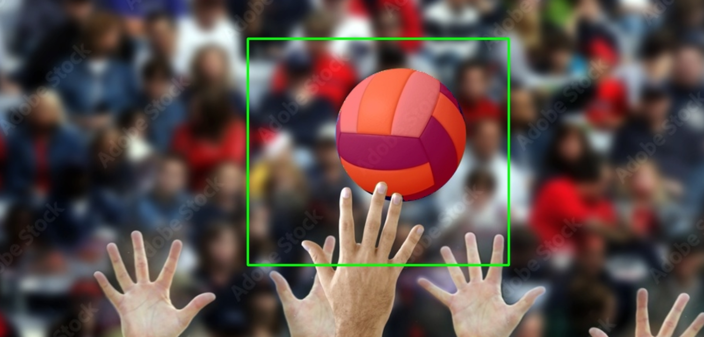
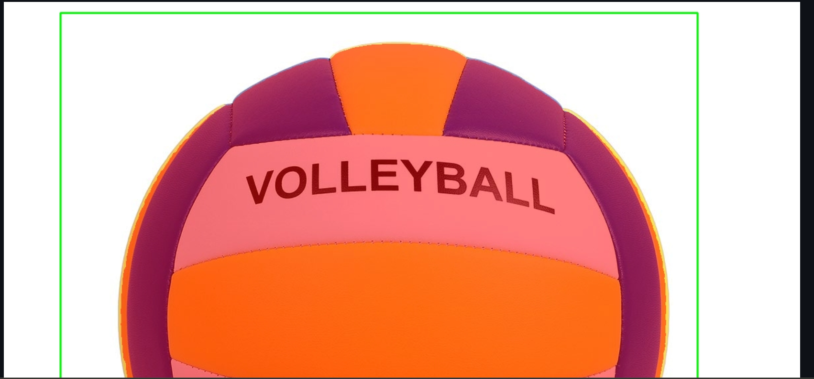

# TP1: Modern Computer Vision

OUALGHAZI Mohamed

## Dépôt du projet:
    https://github.com/simoualghazi/CSC8608/

## Arboresence TP1:

## Environnement d’exécution:
- Environnement conda : deeplearning

- Exécution : nœud GPU via SLURM (arcadia-slurm-node-2)

-Preuve CUDA :

### segment_anything fonctionne

### Streamlit:
port choisi : 5050 

UI accessible via SSH tunnel :Oui
## Exercice 2:

image1.png   — objet unique bien isolé, cas de segmentation simple.

image2.png — forme régulière et contraste élevé.

image4.png — scène très chargée avec de nombreux objets.

image10.png — structure fine et répétitive, segmentation délicate.

image8.png — occlusions multiples (mains, filet, ballon).
### Cas simple:

### Cas complexe:

## Exercice 3:

- Modèle choisi : vit_h
- Checkpoint utilisé : sam_vit_h_4b8939.pth (stocké dans TP1/models/, non commité)

Le modèle SAM se charge correctement sur GPU (cuda). La fonction bbox→masque renvoie un masque binaire de même taille que l’image et un score flottant élevé (~0.96), ce qui indique une segmentation cohérente pour cette image. Le masque n’est pas vide (mask_sum=2566). Un avertissement PyTorch sur torch.load apparaît, mais il n’empêche pas l’exécution et provient du chargement du checkpoint.

## Exercice 4:

| image | score | aire (px) | périmètre |
|---|---:|---:|---:|
| image3.png | 0.9648 | 2566 | 451.35 |
| image6.png | 0.7937 | 8092 | 1160.77 |
| image4.png | 0.6787 | 7561 | 1368.71 |

Les overlays (bbox + masque) permettent de valider rapidement si la bbox guide correctement la segmentation. Sur un cas simple (image3), le masque est compact, le score est élevé (~0.96) et le périmètre reste modéré, ce qui indique une segmentation stable. Sur des scènes plus complexes (image6, image4), les scores diminuent (~0.79 puis ~0.68) et le périmètre augmente fortement, signe d’un contour plus irrégulier et de possibles erreurs (détails du fond inclus, objets voisins dans la bbox). L’overlay aide à identifier si le problème vient d’une bbox trop large/mal placée ou d’une ambiguïté de scène, et il permet d’ajuster le prompt (bbox plus serrée) ou de comparer les multimasks.
## Exercice 5:
1. Cas difficile

2. Cas simple

### Tableau des résultats

| image | bbox [x1,y1,x2,y2] | score | aire (px) | temps (ms) |
|---|---|---:|---:|---:|
| image1.png | [96, 65, 579, 578] | 0.992 | 104246 | 1649.4 |
| image2.png | [85, 182, 1045, 1067] | 1.017 | 529579 | 1644.5 |
| image9.png | [36, 52, 164, 132] | 0.782 | 1589 | 1643.7 |

### Debug : Impact de la taille de la BBox
En agrandissant la bbox, SAM reçoit plus de contexte : cela peut aider si l’objet est grand (ex. image2, aire très élevée), mais augmente aussi le risque d’inclure du fond ou des objets voisins, ce qui gonfle l’aire et rend le contour plus irrégulier. En rétrécissant la bbox, le masque devient souvent plus ciblé , mais si la bbox coupe une partie de l’objet, SAM peut rater des zones ou segmenter un sous-objet. L’overlay permet de voir immédiatement si le masque déborde hors de la zone attendue, et si la bbox doit être resserrée ou recentrée. On observe aussi que les objets fins/détaillés donnent des périmètres relativement élevés par rapport à l’aire, signe de contours plus complexes.

## EXERCICE 6:
### Comparaison Avant / Après

#### Cas 1 : 
**Avant**

masque global couvrant une grande partie de la scène (fond + objets)
**Après**

masque plus localisé sur l’objet d’intérêt, (les mains et la balle)

Points utilisés :
- BG (fond) : (765, 217)
- FG (objet) : (587, 210)

Scores (multimask) :
- idx 0 : 0.6649  
- idx 1 : 0.7963
- idx 2 : 0.8447

Masque choisi :
- mask_idx : 0
- score : 0.6649
- area_px : 103910
- mask_bbox : (90, 51, 962, 646)
- perimeter : 6242.71
- temps : 1640.9 ms

Dans ce cas, l’ajout d’un point BG a été essentiel car la bbox englobe une grande partie de la scène (foule + mains + filet). Sans BG, SAM tend à produire un masque global. Le point BG placé sur une zone de fond permet d’exclure explicitement cette région et de favoriser un masque centré sur l’objet visé.

## Exercice 7:
### Limites observées et pistes d’amélioration

Les principaux échecs de segmentation observés proviennent d’abord des scènes à fond complexe, où une bounding box large conduit SAM à produire un masque global couvrant le fond et plusieurs objets (ex. scène de volley avec foule).  
 Ensuite, les objets fins ou répétitifs (filet, mains) génèrent des masques bruités ou fragmentés, même avec un point FG. Enfin, les ambiguïtés dans la bbox (plusieurs objets plausibles à l’intérieur) rendent le choix du bon masque difficile sans guidage supplémentaire.  
 Pour améliorer la situation, l’ajout systématique de points BG permet d’exclure explicitement le fond ou les objets parasites. Une UI contraignant la taille minimale/maximale de la bbox et encourageant une bbox plus serrée réduirait l’ambiguïté.  
  Enfin, un post-traitement simple (filtrage des petits composants, lissage des contours) ou l’utilisation d’un dataset spécifique au domaine (ex. sports, objets fins) améliorerait la robustesse globale.

### Logging et monitoring pour une intégration produit

Pour industrialiser cette brique, il serait prioritaire de logger la taille de la bounding box (aire relative à l’image) afin de détecter les cas où la segmentation risque d’être ambiguë.  
 Les scores des multimasks et l’index du masque sélectionné par l’utilisateur doivent être enregistrés pour repérer des changements de comportement du modèle.  
  Le temps d’inférence (image embedding + prédiction) est essentiel pour surveiller les régressions de performance GPU.  
   Les métriques géométriques du masque (aire, périmètre, ratio aire/bbox) permettraient de détecter des masques anormalement grands ou fragmentés.    
Enfin, la présence et le type de points de guidage (FG/BG) doivent être loggés pour analyser les cas où une interaction utilisateur est nécessaire, ce qui peut indiquer un drift des données ou des limites du modèle sur certains scénarios.
