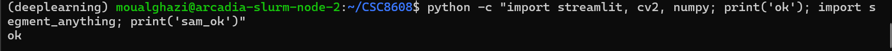
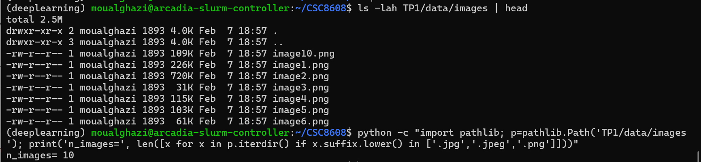
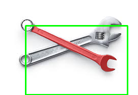

# TP1: Modern Computer Vision

OUALGHAZI Mohamed

## Dépôt du projet:
    https://github.com/simoualghazi/CSC8608/

## Arboresence TP1:

## Environnement d’exécution:
- Environnement conda : deeplearning

- Exécution : nœud GPU via SLURM (arcadia-slurm-node-2)

-Preuve CUDA :

### segment_anything fonctionne

### Streamlit:
port choisi : 5050 

UI accessible via SSH tunnel :Oui
## Exercice 2:

image1.png   — objet unique bien isolé, cas de segmentation simple.

image2.png — forme régulière et contraste élevé.

image4.png — scène très chargée avec de nombreux objets.

image10.png — structure fine et répétitive, segmentation délicate.

image8.png — occlusions multiples (mains, filet, ballon).
### Cas simple:

### Cas complexe:

## Exercice 3:

- Modèle choisi : vit_h
- Checkpoint utilisé : sam_vit_h_4b8939.pth (stocké dans TP1/models/, non commité)

Le modèle SAM se charge correctement sur GPU (cuda). La fonction bbox→masque renvoie un masque binaire de même taille que l’image et un score flottant élevé (~0.96), ce qui indique une segmentation cohérente pour cette image. Le masque n’est pas vide (mask_sum=2566). Un avertissement PyTorch sur torch.load apparaît, mais il n’empêche pas l’exécution et provient du chargement du checkpoint.

## Exercice 4:

| image | score | aire (px) | périmètre |
|---|---:|---:|---:|
| image3.png | 0.9648 | 2566 | 451.35 |
| image6.png | 0.7937 | 8092 | 1160.77 |
| image4.png | 0.6787 | 7561 | 1368.71 |

Les overlays (bbox + masque) permettent de valider rapidement si la bbox guide correctement la segmentation. Sur un cas simple (image3), le masque est compact, le score est élevé (~0.96) et le périmètre reste modéré, ce qui indique une segmentation stable. Sur des scènes plus complexes (image6, image4), les scores diminuent (~0.79 puis ~0.68) et le périmètre augmente fortement, signe d’un contour plus irrégulier et de possibles erreurs (détails du fond inclus, objets voisins dans la bbox). L’overlay aide à identifier si le problème vient d’une bbox trop large/mal placée ou d’une ambiguïté de scène, et il permet d’ajuster le prompt (bbox plus serrée) ou de comparer les multimasks.
## Exercice 5:
