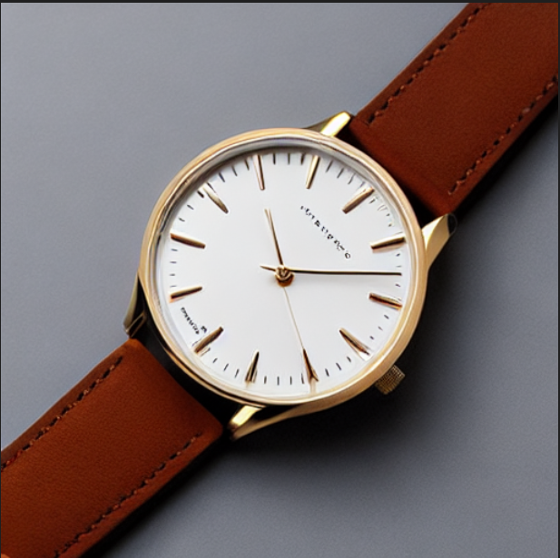
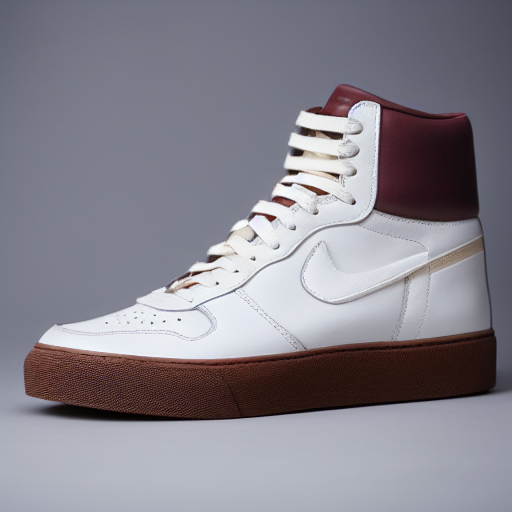
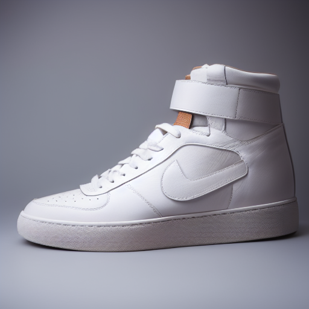
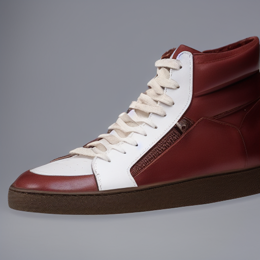

# TP 2
**OUALGHAZI Mohamed**
# Exercice 1:

# Exercice 2:
### Baseline text-to-image

Configuration :
- model_id: stable-diffusion-v1-5/stable-diffusion-v1-5
- scheduler: EulerA
- seed: 42
- steps: 30
- guidance: 7.5

Résultat : génération stable et reproductible d’une image produit (512×512).
# Exercice 3:
**Paramètres des expériences**

*   **Prompt**:
ultra-realistic product photo of a leather sneaker on a white background, studio lighting, soft shadow, 85mm lens, very sharp

*   **Seed**: 42
| Run 1: Baseline   (EulerA, 30 steps, γ=7.5) | Run 2: Steps bas   (15 steps) | Run 3: Steps hauts   (50 steps) |
| :---: | :---: | :---: |
|  |  |  |
| **Run 4: Guidance bas   (γ=4.0)** | **Run 5: Guidance haut   (γ=12.0)** | **Run 6: Scheduler DDIM** |
|  |  |  |