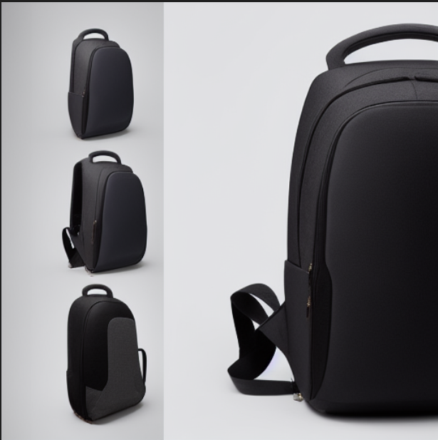
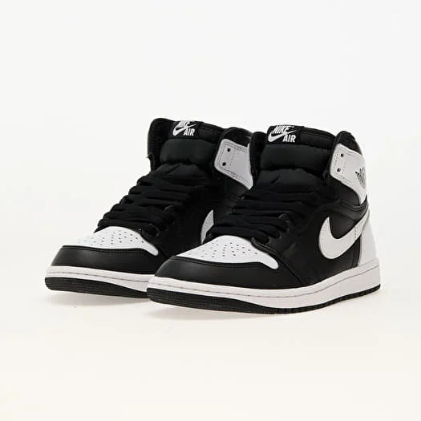
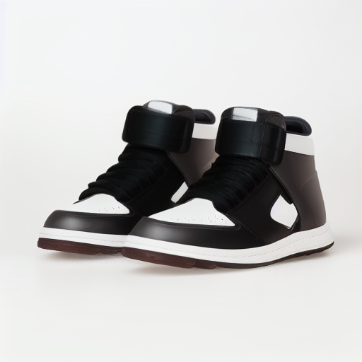
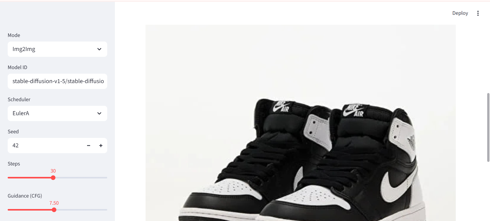
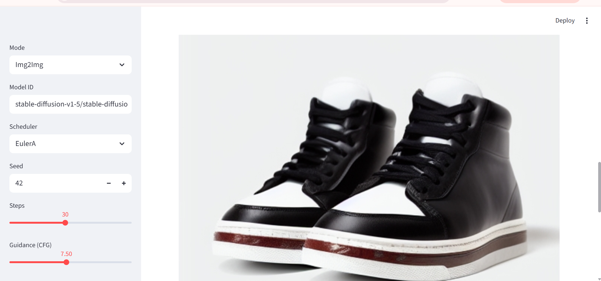
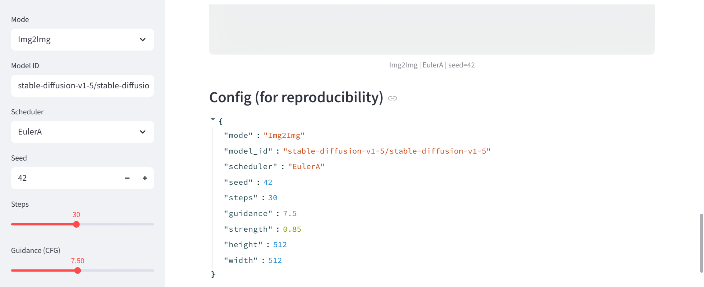
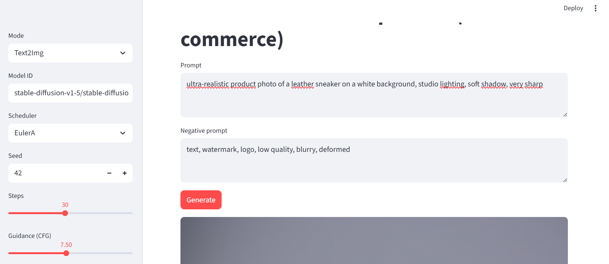
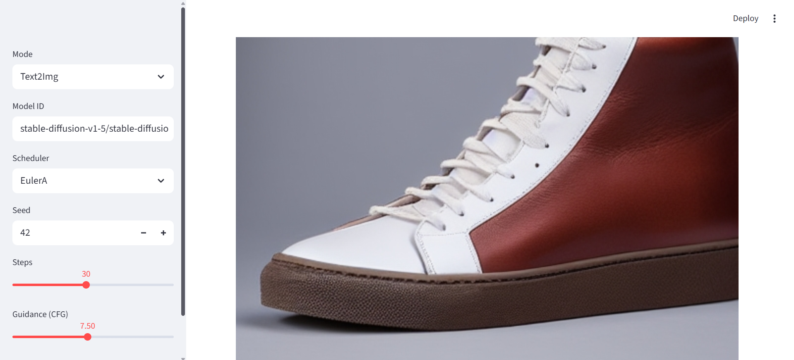
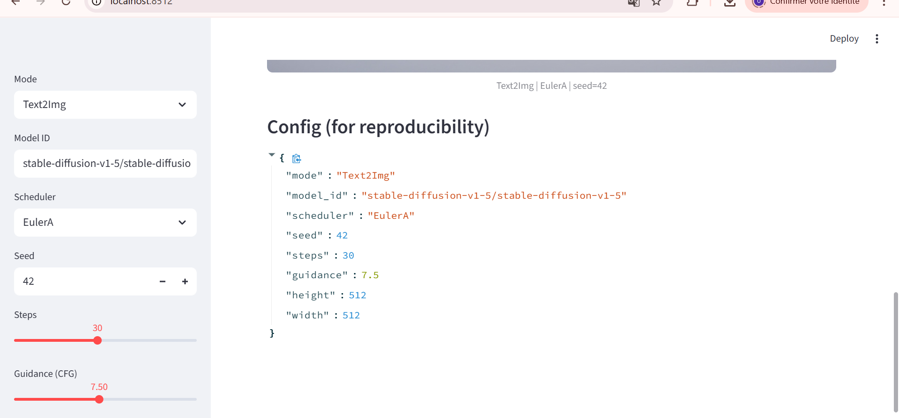

# TP 2
**OUALGHAZI Mohamed**
# Exercice 1:

# Exercice 2:
### Baseline text-to-image

Configuration :
- model_id: stable-diffusion-v1-5/stable-diffusion-v1-5
- scheduler: EulerA
- seed: 42
- steps: 30
- guidance: 7.5

Résultat : génération stable et reproductible d’une image produit (512×512).
# Exercice 3:
**Paramètres des expériences**

*   **Prompt**:
ultra-realistic product photo of a leather sneaker on a white background, studio lighting, soft shadow, 85mm lens, very sharp

*   **Seed**: 42

| Run ID           | Scheduler | Steps | Guidance (γ) | Objectif de l'expérience                     |
| :--------------- | :-------- | :---- | :----------- | :------------------------------------------- |
| `run01_baseline` | EulerA    | 30    | 7.5          | Référence de base                            |
| `run02_steps15`  | EulerA    | 15    | 7.5          | Évaluer l'effet de `steps` insuffisants      |
| `run03_steps50`  | EulerA    | 50    | 7.5          | Évaluer l'effet de `steps` élevés            |
| `run04_guid4`    | EulerA    | 30    | 4.0          | Évaluer l'effet d'une `guidance` faible      |
| `run05_guid12`   | EulerA    | 30    | 12.0         | Évaluer l'effet d'une `guidance` forte       |
| `run06_ddim`     | DDIM      | 30    | 7.5          | Comparer l'impact du `scheduler`             |

### Grille de Comparaison Visuelle

| Run 1: Baseline   (EulerA, 30 steps, γ=7.5) | Run 2: Steps bas   (15 steps) | Run 3: Steps hauts   (50 steps) |
| :---: | :---: | :---: |
|  |  |  |
| **Run 4: Guidance bas   (γ=4.0)** | **Run 5: Guidance haut   (γ=12.0)** | **Run 6: Scheduler DDIM** |
|  |  |  |

- Steps (15 → 30 → 50) : moins de steps réduit le temps mais peut dégrader la netteté ; 30 est un bon compromis ; 50 améliore parfois les détails avec un coût en temps plus élevé.
- Guidance/CFG (4.0 → 7.5 → 12.0) : CFG faible donne plus de liberté au modèle ; CFG élevé force la fidélité au prompt mais peut produire des artefacts ou un rendu trop contraint.
- Scheduler (EulerA vs DDIM) : EulerA produit souvent des textures plus contrastées, DDIM un rendu plus lisse et stable.
# Exercice 4:

### Grille de comparaison visuelle

| Image Source | Strength = 0.35 | Strength = 0.60 | Strength = 0.85 |
| :---: | :---: | :---: | :---: |
|  |  |  |  |

### Img2Img — Impact de strength (EulerA, seed=42, steps=30, CFG=7.5)

- **Strength 0.35** : conserve fortement la structure (cadrage, forme globale, identité du produit). Changements limités (texture/éclairage subtils).
- **Strength 0.60** : compromis : le produit reste reconnaissable mais davantage d’éléments changent (matière, détails, fond reconstruit).
- **Strength 0.85** : éloignement fort de l’image source : la structure peut être altérée (détails/proportions), le rendu devient plus “créatif”.
- **Utilisabilité e-commerce** : à strength élevé, génération d'une image trop différente du produit réel → moins acceptable pour une fiche produit (fidélité faible), utile plutôt pour concepts/variations.

# Exercice 5:

# Exercice 6:
#### Évaluation 1 : Text2Img Baseline (`run01_baseline`)

*   **Prompt adherence**: 2/2
*   **Visual realism**: 2/2
*   **Artifacts**: 2/2
*   **E-commerce usability**: 2/2
*   **Reproducibility**: 2/2
*   **TOTAL**: **10/10**

Justification :
- Produit bien centré, fond blanc et éclairage studio globalement conformes au prompt.
- Paramètres complets (seed, steps, CFG, scheduler, modèle, taille) → reproductible.

#### Évaluation 2 : Text2Img Guidance Élevé (`run05_guid12`)

*   **Prompt adherence**: 2/2
*   **Visual realism**: 1/2
*   **Artifacts**: 1/2
*   **E-commerce usability**: 1/2
*   **Reproducibility**: 2/2
*   **TOTAL**: **7/10**

Justification :
- Le paramètre extrême renforce/affaiblit l’alignement au prompt mais dégrade la naturalité (rendu trop “forcé” en CFG haut ou manque de détails en steps bas).
- Artefacts plus visibles (textures bizarres, contours instables, ombres incohérentes) → retouches plus lourdes.
- Reproductibilité OK car config explicitée.

#### Évaluation 3 : Img2Img Strength Élevé (`run09_strength085`)
Scores :
- Prompt adherence: 1
- Visual realism: 1
- Artifacts: 1
- E-commerce usability: 0
- Reproducibility: 2
**Total: 5/10**

Justification :
- À strength élevé, le modèle s’éloigne fortement de l’image source : identité du produit moins fiable (risque “produit différent”).
- Certains détails peuvent être inventés (matière, logos implicites, coutures) → risque e-commerce.
- Paramètres + image source + seed permettent de reproduire, mais l’utilisabilité est faible sans contrôle supplémentaire.

## Réflexion (POC → usage e-commerce)

On observe un compromis direct quality vs latency/cost : augmenter le nombre de steps améliore souvent la netteté et la cohérence, mais le temps (et donc le coût GPU) augmente, et le gain peut devenir marginal au-delà d’un certain seuil. Le scheduler influence aussi ce compromis (texture/stabilité) : certains schedulers donnent un rendu plus “détaillé” mais peuvent être plus sensibles au prompt.  
 La reproductibilité nécessite au minimum : model_id exact, scheduler, seed, steps, guidance/CFG, taille (H×W), mode (t2i/i2i) et pour img2img l’image source + strength ; malgré cela, des changements de version (diffusers/torch), de GPU/dtype ou de backend peuvent casser une reproduction parfaite.  
En e-commerce, les risques majeurs sont les hallucinations (détails inventés), les images trompeuses (produit différent), et la non-conformité (texte/logos/watermarks). Pour limiter ces risques, je mettrais des garde-fous : negative prompts stricts, filtrage automatique de texte/logos, validation humaine, et pour img2img des strengths plafonnés + points de contrôle (comparaison structurelle avec l’image source) avant publication.

