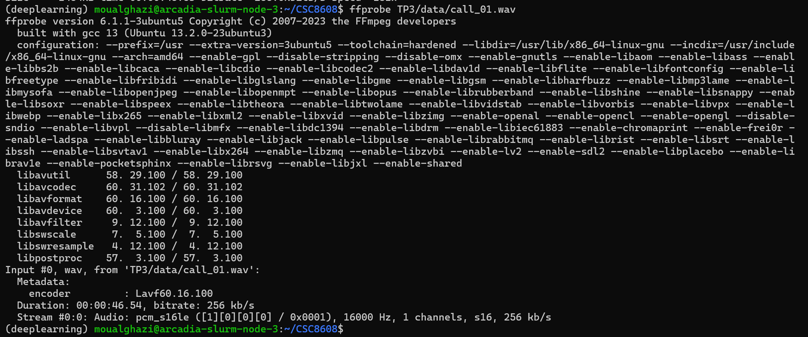
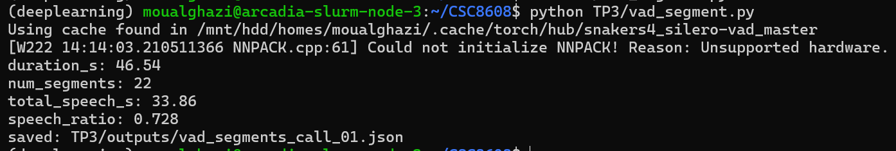
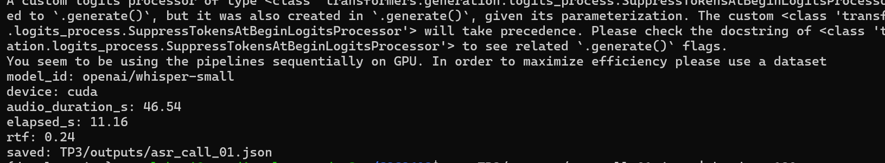
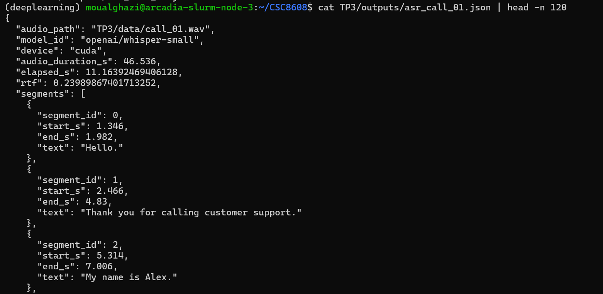
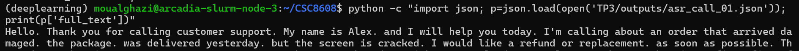
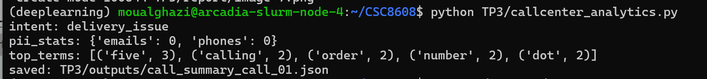
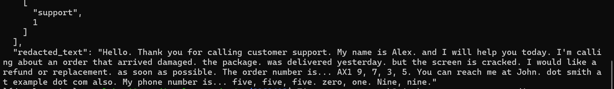

# TP 3
**OUALGHAZI Mohamed**
# Exercice 1:

# Exercice 2:

L’audio est en WAV mono 16 kHz conforme aux exigences.  
La durée est de 46.54 secondes.  
Le RMS (0.0112) indique un niveau sonore modéré sans saturation.  
Le clipping rate est nul (0.0), ce qui confirme l’absence de distorsion.  

# Exercice 3:

## les 5 segments:
{"start_s": 1.346, "end_s": 1.982}
{"start_s": 2.466, "end_s": 4.83}
{"start_s": 5.314, "end_s": 7.006}
{"start_s": 7.298, "end_s": 8.83}
{"start_s": 9.378, "end_s": 11.486}
## analyse :
Le ratio parole/silence est ~0.74, ce qui semble cohérent avec une lecture assez continue du texte avec quelques pauses (respiration et ponctuation). Les segments sont nombreux (23), ce qui reflète des micro-silences entre phrases ou mots.  
## Question 3.d:

En passant de min_dur_s = 0.30 à 0.60, num_segments diminue (23 → 22) et speech_ratio baisse légèrement (0.739 → 0.728), ce qui est cohérent car des segments de parole très courts sont filtrés.

# Exercice 4:

## Extrait des 5 segments: 

{"segment_id": 0, "start_s": 1.346, "end_s": 1.982, "text": "Hello."}
{"segment_id": 1, "start_s": 2.466, "end_s": 4.83, "text": "Thank you for calling customer support."}
{"segment_id": 2, "start_s": 5.314, "end_s": 7.006, "text": "My name is Alex."}
{"segment_id": 3, "start_s": 7.298, "end_s": 8.83, "text": "and I will help you today."}
{"segment_id": 4, "start_s": 9.378, "end_s": 11.486, "text": "I'm calling about an order"}
## Extrait “full_text”:

## Analyse :
La segmentation VAD aide à limiter les silences et à garder une transcription stable, avec une latence faible (RTF ≈ 0.24 sur GPU). En revanche, elle peut fragmenter des phrases : par exemple “My name is Alex.” puis “and I will help you today.” sont séparées, et “I would like a refund” / “or replacement.” aussi. On observe aussi des débuts tronqués (“the package.”) et une ponctuation moins naturelle à la reconstruction par simple concaténation. Globalement, le VAD est utile pour contrôler coût/latence, mais un post-traitement (fusion de segments proches, ajout de ponctuation) améliorerait le rendu.
# Exercice 5:

Aprés modification:

Après ajout du post-traitement, l’email est correctement détecté et masqué (emails=1), alors qu’il n’était pas reconnu auparavant. En revanche, le numéro de téléphone et l’order number ne sont pas détectés.

**Analyse:**

Les erreurs de transcription Whisper qui impactent le plus les analytics sont liées aux entités épelées ou parlées. Par exemple, l’email est initialement transcrit sous la forme “dot … at … dot …”, ce qui empêche une détection naïve.  
Le numéro de téléphone est transcrit en mots (“five, five, five…”), ce qui complique sa normalisation. De plus, l’order number est fragmenté (“AX1 9, 7, 3, 5”), ce qui rend sa détection fragile sans heuristique plus robuste. Ces erreurs ASR impactent directement la redaction PII et montrent l’importance d’un post-traitement adapté au contexte call center.