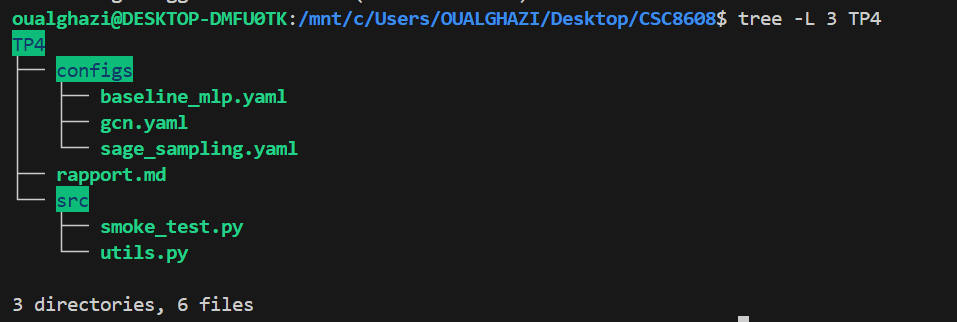
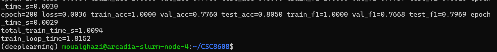

# TP 4: Deep learning pour audio
**OUALGHAZI Mohamed**
# Exercice 1:    

**Sortie du smoke test**

# Exercice 2:

**train_mask :** mesure la perf sur les nœuds utilisés pour optimiser (surveille underfit/overfit et la progression réelle de l’apprentissage).

**val_mask :**sert à choisir les hyperparamètres / décider d’un early stopping sans “tricher” sur le test.

**test_mask :**estimation finale “neutre” de la généralisation, à regarder une fois le modèle choisi.

Séparer évite de surestimer la perf : si on tune sur le test, on biaise les résultats.

 # Exercice 3:
 # MLP :
 
# GCN :

| Modèle | Test Accuracy | Test Macro-F1 | Total Train Time (s) |
|--------|--------------:|--------------:|---------------------:|
| MLP    | 0.5790       | 0.5651       | 2.4951              |
| GCN    | 0.8030       | 0.7930       | 1.2979              |

### Pourquoi le GCN surpasse-t-il le MLP ici ?

Sur Cora, le graphe apporte un signal fort car le dataset est homophile : des nœuds reliés ont souvent le même label (mêmes thématiques d’articles). Le MLP ne voit que les features du nœud, alors que la GCN agrège les features des voisins, ce qui “débruite” et enrichit la représentation et améliore nettement la généralisation (ici ~0.80 vs ~0.58 en test_acc). En contrepartie, une GCN peut souffrir de lissage (over-smoothing) si on empile trop de couches : les embeddings deviennent trop similaires et la perf peut plafonner/baisser. Dans notre cas (2 couches), on profite du voisinage sans trop lisser. Si les features seules étaient déjà extrêmement discriminantes, l’écart MLP/GCN serait plus faible, voire en faveur du MLP.

# Exercice 4:
### SAGE

### Tableau final (MLP vs GCN vs GraphSAGE):

| Modèle | Test Accuracy | Test Macro-F1 | Total Train Time (s) |
|--------|--------------:|--------------:|---------------------:|
| MLP    | 0.5790        | 0.5651        | 2.4951              |
| GCN    | 0.8030        | 0.7930        | 1.2979              |
| SAGE (sampling) | 0.8050 | 0.7969      | 1.0094              |

### ### Compromis du Neighbor Sampling:

Le neighbor sampling accélère l’entraînement car on ne propage plus les messages sur tout le graphe à chaque itération : on entraîne sur des mini-batchs de nœuds “seed” et on échantillonne un sous-graphe local avec un fanout fixé (ici num_neighbors=[10,10]). Le coût par itération devient contrôlé par batch_size × fanout, ce qui rend GraphSAGE scalable sur de grands graphes. En contrepartie, le gradient est estimé sur un sous-graphe aléatoire : l’optimisation devient plus bruitée (variance plus élevée), et la performance peut dépendre du fanout (trop faible → voisinage incomplet, trop élevé → coût proche du full-batch). Les nœuds à très fort degré (“hubs”) peuvent aussi introduire du bruit ou des biais selon l’échantillonnage. Enfin, le sampling peut coûter côté CPU/loader (construction des sous-graphes et transferts), ce qui peut devenir un goulot si le backend accéléré (pyg-lib) n’est pas installé.