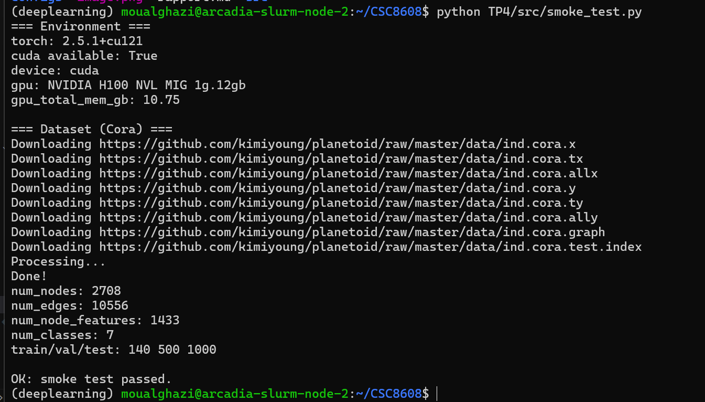
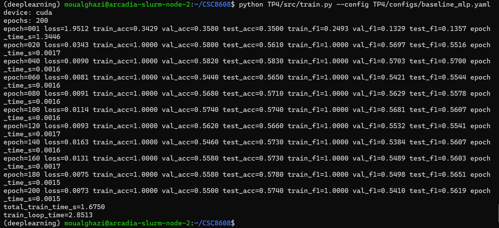
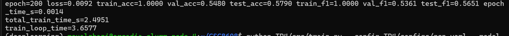
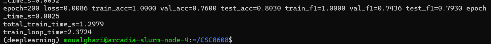
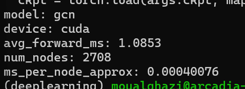
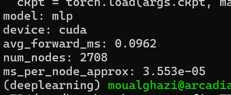
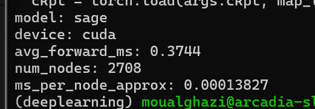

# TP 4: Deep learning pour audio
**OUALGHAZI Mohamed**
# Exercice 1:    

**Sortie du smoke test**

# Exercice 2:

**train_mask :** mesure la perf sur les nœuds utilisés pour optimiser (surveille underfit/overfit et la progression réelle de l’apprentissage).

**val_mask :**sert à choisir les hyperparamètres / décider d’un early stopping sans “tricher” sur le test.

**test_mask :**estimation finale “neutre” de la généralisation, à regarder une fois le modèle choisi.

Séparer évite de surestimer la perf : si on tune sur le test, on biaise les résultats.

 # Exercice 3:
 # MLP :
 
# GCN :

| Modèle | Test Accuracy | Test Macro-F1 | Total Train Time (s) |
|--------|--------------:|--------------:|---------------------:|
| MLP    | 0.5790       | 0.5651       | 2.4951              |
| GCN    | 0.8030       | 0.7930       | 1.2979              |

### Pourquoi le GCN surpasse-t-il le MLP ici ?

Sur Cora, le graphe apporte un signal fort car le dataset est homophile : des nœuds reliés ont souvent le même label (mêmes thématiques d’articles). Le MLP ne voit que les features du nœud, alors que la GCN agrège les features des voisins, ce qui “débruite” et enrichit la représentation et améliore nettement la généralisation (ici ~0.80 vs ~0.58 en test_acc). En contrepartie, une GCN peut souffrir de lissage (over-smoothing) si on empile trop de couches : les embeddings deviennent trop similaires et la perf peut plafonner/baisser. Dans notre cas (2 couches), on profite du voisinage sans trop lisser. Si les features seules étaient déjà extrêmement discriminantes, l’écart MLP/GCN serait plus faible, voire en faveur du MLP.

# Exercice 4:
### SAGE

### Tableau final (MLP vs GCN vs GraphSAGE):

| Modèle | Test Accuracy | Test Macro-F1 | Total Train Time (s) |
|--------|--------------:|--------------:|---------------------:|
| MLP    | 0.5790        | 0.5651        | 2.4951              |
| GCN    | 0.8030        | 0.7930        | 1.2979              |
| SAGE (sampling) | 0.8050 | 0.7969      | 1.0094              |

### ### Compromis du Neighbor Sampling:

Le neighbor sampling accélère l’entraînement car on ne propage plus les messages sur tout le graphe à chaque itération : on entraîne sur des mini-batchs de nœuds “seed” et on échantillonne un sous-graphe local avec un fanout fixé (ici num_neighbors=[10,10]). Le coût par itération devient contrôlé par batch_size × fanout, ce qui rend GraphSAGE scalable sur de grands graphes. En contrepartie, le gradient est estimé sur un sous-graphe aléatoire : l’optimisation devient plus bruitée (variance plus élevée), et la performance peut dépendre du fanout (trop faible → voisinage incomplet, trop élevé → coût proche du full-batch). Les nœuds à très fort degré (“hubs”) peuvent aussi introduire du bruit ou des biais selon l’échantillonnage. Enfin, le sampling peut coûter côté CPU/loader (construction des sous-graphes et transferts), ce qui peut devenir un goulot si le backend accéléré (pyg-lib) n’est pas installé.

# Exercice 5:

### GCN :

### MLP :

### SAGE : 

### Tableau synthétique des résultats

| Modèle | test_acc | test_f1 | total_train_time_s | avg_forward_ms |
|-------|---------:|--------:|-------------------:|---------------:|
| MLP   | 0.5790   | 0.5651  | 2.4951             | 0.0962 |
| GCN   | 0.8030   | 0.7930  | 1.2979             | 1.0853 |
| SAGE  | 0.8050   | 0.7969  | 1.0094             | 0.3744 |

### Pourquoi faire un warmup et synchroniser CUDA avant/après la mesure 

Warmup est utilisé car les premières itérations sur GPU incluent souvent des coûts d’initialisation (allocation mémoire CUDA, compilation ou sélection de kernels, remplissage des caches). Mesurer directement la première exécution donnerait une latence artificiellement élevée et non représentative du régime stable. On exécute donc plusieurs forwards non mesurés avant le benchmark.

Sur GPU, l’exécution PyTorch est asynchrone : les opérations sont envoyées au GPU mais ne bloquent pas immédiatement le CPU. Sans synchronisation, le timer mesurerait surtout le temps de lancement des kernels et non leur exécution réelle. En appelant torch.cuda.synchronize() avant et après la section mesurée, on force la fin des opérations GPU et on obtient une mesure correcte et reproductible de la latence.

# Exercice 6:
## Tableau comparatif final

| Modèle      | test_acc | test_macro_f1 | total_train_time_s | train_loop_time | avg_forward_ms |
|-------------|----------|---------------|--------------------|----------------|----------------|
| MLP         | 0.5790   | 0.5651        | 2.4951             | 3.6577         | 0.0962         |
| GCN         | 0.8030   | 0.7930        | 1.2979             | 2.3724         | 1.0853         |
| GraphSAGE   | 0.8050   | 0.7969        | 1.0094             | 1.8152         | 0.3744         |

**Recommandation ingénieur**  
Dans ce TP, les modèles GNN exploitant la structure du graphe (GCN et GraphSAGE) obtiennent des performances nettement supérieures au MLP. Le MLP atteint seulement 0.5790 de test accuracy, alors que GCN et GraphSAGE dépassent 0.80, ce qui montre que le signal du graphe apporte une information importante sur Cora. Cependant, le MLP reste le modèle le plus rapide en inférence (0.096 ms par forward), ce qui peut être utile dans des systèmes très contraints en latence où la qualité est secondaire.

Le GCN offre une forte amélioration de qualité (0.8030 accuracy, 0.7930 macro-F1), mais il présente la latence d’inférence la plus élevée (~1.08 ms), car chaque couche agrège les informations des voisins du graphe. GraphSAGE obtient une qualité similaire (0.8050 accuracy, 0.7969 macro-F1) tout en étant plus rapide en entraînement et en inférence (~0.37 ms par forward), grâce au neighbor sampling qui limite le nombre de voisins traités.

Ainsi, dans un contexte réel, je choisirais MLP si la structure du graphe n’est pas disponible ou si la latence d’inférence est la contrainte principale. Je choisirais GCN lorsque la priorité est la qualité maximale sur un graphe de taille modérée. Enfin, pour des graphes plus grands ou lorsque l’on cherche un bon compromis entre qualité et coût de calcul, GraphSAGE apparaît comme la solution la plus équilibrée.

**Risque de protocole pouvant fausser la comparaison**

Un risque important dans ce type de comparaison est la variabilité liée à l’aléatoire (initialisation des poids, ordre des mini-batchs, sampling des voisins pour GraphSAGE). Sans fixer une seed, les résultats peuvent varier entre exécutions et rendre la comparaison entre modèles peu fiable. Dans ce TP, ce problème est partiellement contrôlé grâce à la fonction set_seed, mais dans un vrai projet il serait préférable de répéter les expériences plusieurs fois et de rapporter la moyenne et l’écart-type des métriques.

Un autre risque concerne la comparabilité des mesures de performance. Les temps d’entraînement et de latence peuvent varier selon que l’on mesure sur CPU ou GPU, ou si l’on oublie de synchroniser CUDA avant les mesures. De plus, les premières itérations peuvent inclure des coûts d’initialisation ou de caching. Pour obtenir des mesures fiables dans un projet réel, il faudrait utiliser un protocole de benchmark strict : même matériel, warmup avant mesure, synchronisation GPU, et plusieurs répétitions pour stabiliser les résultats.

**Remarque dépôt :** Tous les fichiers volumineux ont été exclus du dépôt.