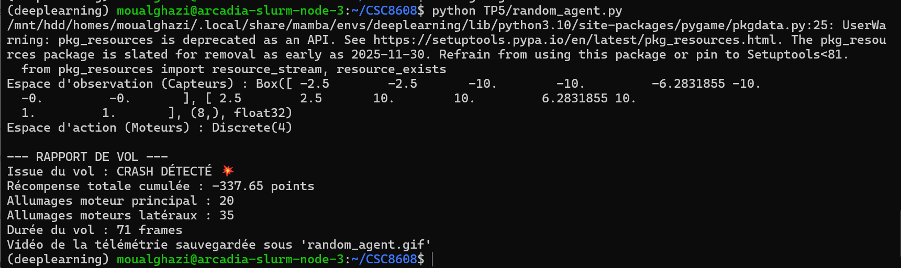
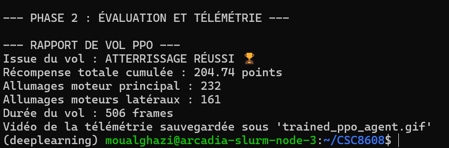
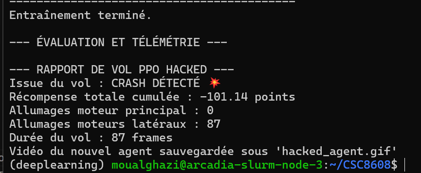
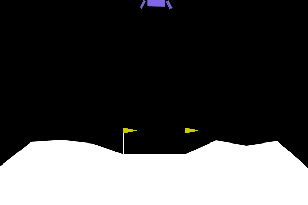
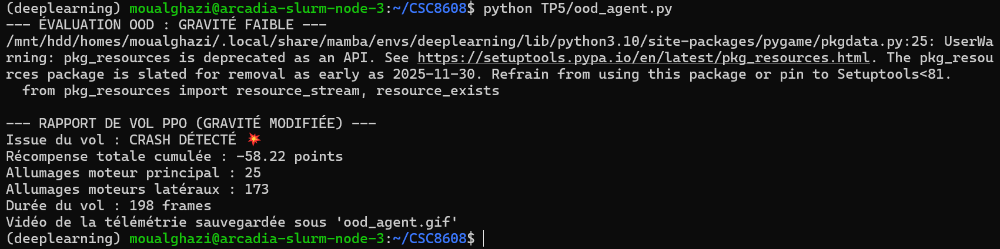

# TP 5: 
**OUALGHAZI Mohamed**
# Exercice 1:

Dans notre exécution, l’agent aléatoire obtient une récompense totale de -337.65 points.
L’écart au seuil de résolution est donc :

200 - (-337.65) = 537.65 points

L’agent est donc très loin de résoudre l’environnement. Ce résultat est logique, car il choisit ses actions au hasard sans tenir compte de l’état du module lunaire. Il ne développe aucune stratégie de stabilisation, de ralentissement ou d’atterrissage contrôlé.

# Execice 2:

Pendant l’entraînement, la métrique `ep_rew_mean` a globalement augmenté. 
Vers la fin de l’apprentissage, elle se situait autour de 110 à 127 points, avec une dernière valeur observée à 127. 
Cela montre que l’agent PPO a appris une politique bien meilleure qu’un comportement aléatoire, même si la récompense moyenne d’entraînement n’a pas dépassé 200.

sur l’épisode d’évaluation que tu as exécuté, l’agent a atteint le seuil :

* score PPO : 204.74

* seuil : 200

**Comparaison avec l’agent aléatoire**  
- **Agent aléatoire**

issue : crash  
score : -337.65  
moteur principal : 20  
moteurs latéraux : 35  
durée : 71 frames

- **Agent PPO**

issue : atterrissage réussi  
score : 204.74  
moteur principal : 232  
moteurs latéraux : 161  
durée : 506 frames

- Pour le carburant, il utilise beaucoup plus les moteurs que l’agent aléatoire, mais cette consommation est utile et contrôlée, car elle permet un atterrissage réussi. L’agent aléatoire, lui, consomme moins mais s’écrase rapidement.

# Exercice 3:

**Évolution de la récompense moyenne**

Pendant l’entraînement, la métrique ep_rew_mean est restée négative, autour de -116 à -112 points.
Cela montre que l’agent n’a pas appris à réussir réellement l’atterrissage, mais plutôt à optimiser la fonction de récompense modifiée.

**Stratégie adoptée par l’agent**

L’agent a appris à ne jamais utiliser le moteur principal.
Le rapport de vol montre en effet 0 allumage du moteur principal contre 87 utilisations des moteurs latéraux.
Le module finit par s’écraser, ce qui montre que l’agent privilégie l’évitement de la pénalité plutôt que le succès de la mission.

**Explication logique et mathématique**

Dans l’environnement modifié, chaque utilisation du moteur principal ajoute une pénalité de 50 points :

r'(t) = r(t) - 50 si action = 2

L’agent cherche à maximiser la somme des récompenses cumulées :

R = somme de  r_t

Ainsi, s’il utilise le moteur principal n fois, il perd :

50 × n

Cette pénalité devient rapidement énorme. Par exemple, 10 activations coûtent déjà 500 points.
L’agent apprend donc qu’il est plus avantageux, du point de vue de la récompense, de ne jamais utiliser le moteur principal, même si cela conduit à un crash.

# Exercice 4:

**Analyse du comportement**

L’agent PPO entraîné sur l’environnement standard ne parvient plus à se poser correctement lorsque la gravité est réduite à -2.0.
Le vol se termine par un crash avec une récompense totale négative de -58.22 points.
On observe également une forte utilisation des moteurs latéraux (173 allumages), ce qui suggère que l’agent corrige beaucoup sa position ou son orientation, mais sans réussir à contrôler correctement l’atterrissage.

**Explication technique**

L’agent a été entraîné uniquement sur une physique correspondant à une gravité de -10.0.
Il a donc appris une politique adaptée à cette dynamique précise.
Lorsque la gravité passe à -2.0, la vitesse de chute, le temps disponible pour corriger la trajectoire et l’effet relatif des moteurs changent.
Les observations fournies à l’agent deviennent alors différentes de celles rencontrées pendant l’entraînement.
La politique apprise ne généralise pas correctement à cette nouvelle distribution d’états, ce qui provoque des actions mal synchronisées et un échec de l’atterrissage.

# Exercice 5 

Le problème observé dans l’exercice précédent vient du fait que l’agent PPO a été entraîné dans un environnement trop spécifique. 
Il a appris une politique très efficace pour une gravité donnée, mais il généralise mal dès que la physique change. 
Pour rendre l’agent robuste sans entraîner un modèle distinct pour chaque cas, plusieurs stratégies concrètes peuvent être mises en place.

### 1. Domain Randomization pendant l’entraînement
Une première stratégie consiste à ne plus entraîner l’agent avec une seule gravité fixe, mais avec des paramètres physiques aléatoires à chaque épisode. 
Par exemple, on peut faire varier :
- la gravité,
- la force du vent,
- la turbulence,
- éventuellement la position initiale ou l’angle de départ.

Ainsi, au lieu d’apprendre une politique spécialisée pour un seul monde, l’agent apprend à réussir dans toute une famille d’environnements. 

Dans ce TP, on pourrait créer un wrapper ou une boucle de création d’environnement qui tire aléatoirement une gravité entre plusieurs valeurs, par exemple entre -12.0 et -2.0, puis entraîner PPO sur cette distribution de mondes au lieu d’un seul environnement fixe.

### 2. Enrichir l’observation avec les paramètres physiques
Une deuxième stratégie consiste à donner explicitement à l’agent des informations sur le contexte physique dans lequel il évolue. 
Par exemple, en plus de l’état standard du vaisseau, on peut ajouter dans l’observation :
- la valeur de la gravité,
- la présence ou l’intensité du vent,
- d’autres paramètres globaux du simulateur.

Dans ce cas, l’agent n’a plus besoin de deviner indirectement la physique uniquement à partir de ses capteurs de position et de vitesse. 
Il peut adapter sa politique en fonction du contexte reçu en entrée. 
Cela permet d’utiliser un seul modèle, mais conditionné sur différents environnements.

D’un point de vue ingénierie, cette solution est intéressante car elle ne change pas l’algorithme PPO lui-même : on modifie seulement les données d’entrée fournies au modèle.

### 3. Augmenter la diversité des situations d’entraînement
Une autre stratégie utile est d’élargir fortement la variété des épisodes vus pendant l’apprentissage. 
Même sans changer l’algorithme, on peut varier :
- la position de départ,
- la vitesse initiale,
- l’inclinaison initiale,
- les perturbations pendant le vol.

Cela évite que l’agent mémorise des trajectoires trop spécifiques. 
Il apprend alors des principes de contrôle plus généraux, capables de mieux résister aux changements de dynamique.

