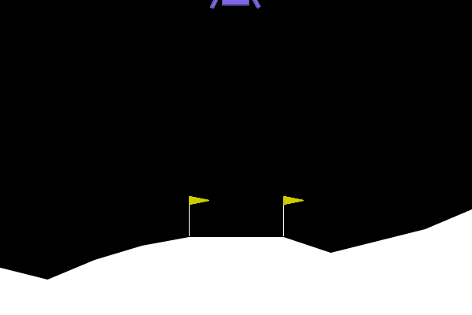

# TP 5: 
**OUALGHAZI Mohamed**
# Exercice 1:

Dans notre exécution, l’agent aléatoire obtient une récompense totale de -337.65 points.
L’écart au seuil de résolution est donc :

200 - (-337.65) = 537.65 points

L’agent est donc très loin de résoudre l’environnement. Ce résultat est logique, car il choisit ses actions au hasard sans tenir compte de l’état du module lunaire. Il ne développe aucune stratégie de stabilisation, de ralentissement ou d’atterrissage contrôlé.

# Execice 2:

Pendant l’entraînement, la métrique `ep_rew_mean` a globalement augmenté. 
Vers la fin de l’apprentissage, elle se situait autour de 110 à 127 points, avec une dernière valeur observée à 127. 
Cela montre que l’agent PPO a appris une politique bien meilleure qu’un comportement aléatoire, même si la récompense moyenne d’entraînement n’a pas dépassé 200.

sur l’épisode d’évaluation que tu as exécuté, l’agent a atteint le seuil :

* score PPO : 204.74

* seuil : 200

**Comparaison avec l’agent aléatoire**  
- **Agent aléatoire**

issue : crash  
score : -337.65  
moteur principal : 20  
moteurs latéraux : 35  
durée : 71 frames

- **Agent PPO**

issue : atterrissage réussi  
score : 204.74  
moteur principal : 232  
moteurs latéraux : 161  
durée : 506 frames

- Pour le carburant, il utilise beaucoup plus les moteurs que l’agent aléatoire, mais cette consommation est utile et contrôlée, car elle permet un atterrissage réussi. L’agent aléatoire, lui, consomme moins mais s’écrase rapidement.

# Exercice 3:

**Évolution de la récompense moyenne**

Pendant l’entraînement, la métrique ep_rew_mean est restée négative, autour de -116 à -112 points.
Cela montre que l’agent n’a pas appris à réussir réellement l’atterrissage, mais plutôt à optimiser la fonction de récompense modifiée.

**Stratégie adoptée par l’agent**

L’agent a appris à ne jamais utiliser le moteur principal.
Le rapport de vol montre en effet 0 allumage du moteur principal contre 87 utilisations des moteurs latéraux.
Le module finit par s’écraser, ce qui montre que l’agent privilégie l’évitement de la pénalité plutôt que le succès de la mission.

**Explication logique et mathématique**

Dans l’environnement modifié, chaque utilisation du moteur principal ajoute une pénalité de 50 points :

r'(t) = r(t) - 50 si action = 2

L’agent cherche à maximiser la somme des récompenses cumulées :

R = somme de  r_t

Ainsi, s’il utilise le moteur principal n fois, il perd :

50 × n

Cette pénalité devient rapidement énorme. Par exemple, 10 activations coûtent déjà 500 points.
L’agent apprend donc qu’il est plus avantageux, du point de vue de la récompense, de ne jamais utiliser le moteur principal, même si cela conduit à un crash.

