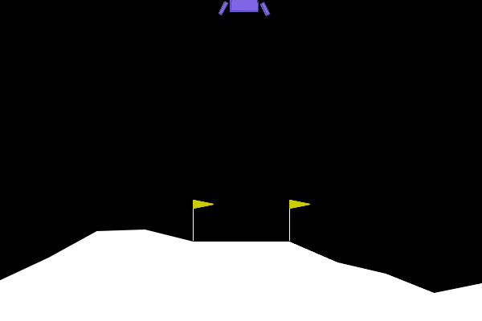
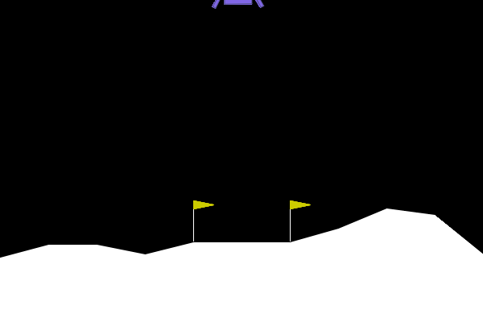

# TP 5: 
**OUALGHAZI Mohamed**
# Exercice 1:

Dans notre exécution, l’agent aléatoire obtient une récompense totale de -337.65 points.
L’écart au seuil de résolution est donc :

200 - (-337.65) = 537.65 points

L’agent est donc très loin de résoudre l’environnement. Ce résultat est logique, car il choisit ses actions au hasard sans tenir compte de l’état du module lunaire. Il ne développe aucune stratégie de stabilisation, de ralentissement ou d’atterrissage contrôlé.

# Execice 2:

Pendant l’entraînement, la métrique `ep_rew_mean` a globalement augmenté. 
Vers la fin de l’apprentissage, elle se situait autour de 110 à 127 points, avec une dernière valeur observée à 127. 
Cela montre que l’agent PPO a appris une politique bien meilleure qu’un comportement aléatoire, même si la récompense moyenne d’entraînement n’a pas dépassé 200.

sur l’épisode d’évaluation que tu as exécuté, l’agent a atteint le seuil :

* score PPO : 204.74

* seuil : 200

**Comparaison avec l’agent aléatoire**  
- **Agent aléatoire**

issue : crash  
score : -337.65  
moteur principal : 20  
moteurs latéraux : 35  
durée : 71 frames

- **Agent PPO**

issue : atterrissage réussi  
score : 204.74  
moteur principal : 232  
moteurs latéraux : 161  
durée : 506 frames

- Pour le carburant, il utilise beaucoup plus les moteurs que l’agent aléatoire, mais cette consommation est utile et contrôlée, car elle permet un atterrissage réussi. L’agent aléatoire, lui, consomme moins mais s’écrase rapidement.

# Exercice 3:
