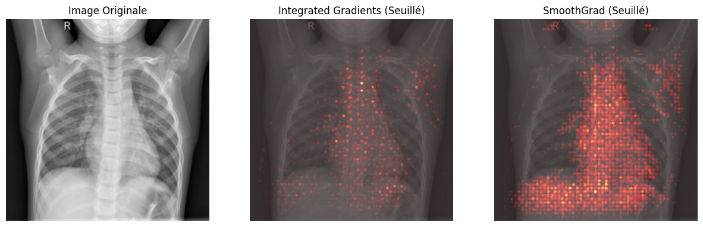
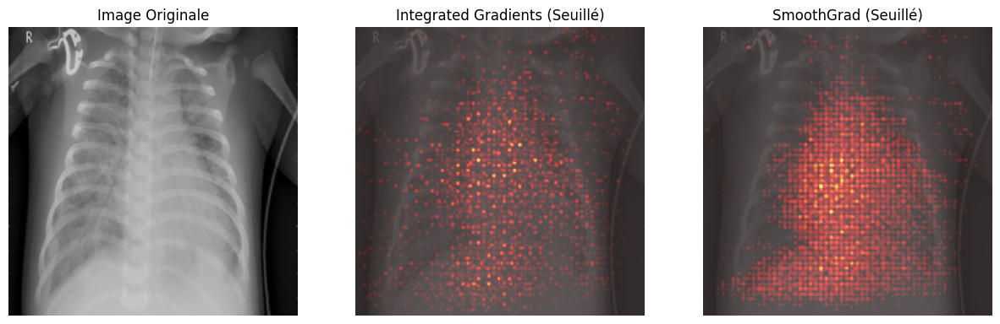
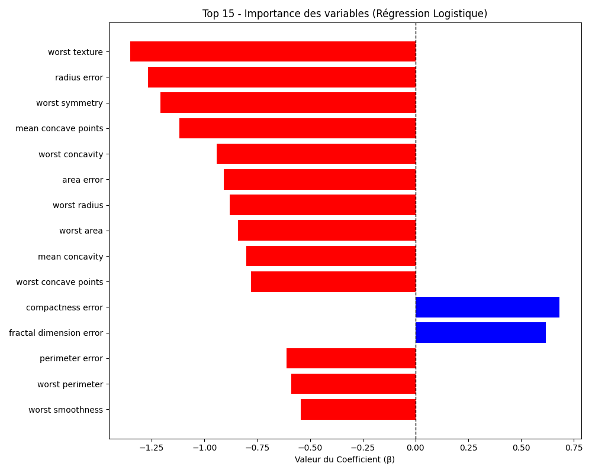

# TP 6: 
**OUALGHAZI Mohamed**
# Exercice 1:

## Grad-CAM normal_1

## Grad-CAM normal_2

## Grad-CAM pneumo_1

## Grad-CAM pneumo_2

**Analyse des faux positifs**

Dans les expériences réalisées, le modèle prédit correctement les classes pour les images testées :

* les images normales sont classées NORMAL
* les images avec pneumonie sont classées PNEUMONIA

L'énoncé suggère que le modèle pourrait produire un faux positif. Dans ce cas, l'analyse Grad-CAM permettrait de comprendre où le modèle regarde pour prendre sa décision.

L’objectif est de vérifier si l’attention du modèle se concentre réellement sur les zones pulmonaires présentant des anomalies, ou si elle se base sur des artefacts de l’image (bordures, zones sombres, annotations, contraste local, etc.).

Si la heatmap se concentrait sur des éléments non médicaux, cela indiquerait un comportement de type effet Clever Hans.
Ce phénomène correspond à un modèle qui apprend des corrélations trompeuses dans les données plutôt que de détecter de véritables caractéristiques médicales.

Dans nos visualisations Grad-CAM, les zones activées se situent principalement dans la région thoracique, ce qui suggère que le modèle utilise bien des indices présents dans les poumons pour effectuer sa prédiction.

 **Granularité de l’explication**

Les cartes Grad-CAM obtenues présentent une résolution relativement faible : les zones colorées apparaissent sous forme de blocs flous et étendus plutôt que des régions très précises au niveau du pixel.

Cette perte de précision provient de l’architecture du réseau ResNet utilisé par le modèle.

Au cours du passage dans le réseau de neurones convolutionnel :

l’image est progressivement transformée par plusieurs couches de convolution,
des opérations de downsampling (réduction de dimension) sont appliquées,
la résolution spatiale des cartes de caractéristiques diminue progressivement.

Grad-CAM utilise la dernière couche convolutionnelle du réseau pour générer l’explication.
À ce stade du réseau, la représentation spatiale de l’image est déjà fortement réduite.

La carte d’activation obtenue possède donc une résolution beaucoup plus faible que l’image originale.
Pour l’afficher sur l’image d’origine, cette carte est réinterpolée (upsampling), ce qui explique l’apparition de zones larges et floues dans la visualisation.

Ainsi, Grad-CAM fournit une explication sémantique globale indiquant les régions importantes pour la prédiction, mais il ne permet pas une localisation précise au niveau du pixel.

# Exercice 2 

### Visualisation comparative

#### Image normale

#### Image pneumonie

Ces visualisations comparent deux méthodes d’explicabilité : **Integrated Gradients (IG)** et **SmoothGrad**.  
Integrated Gradients permet d’obtenir une attribution précise au niveau du pixel en intégrant les gradients entre une image de référence (baseline) et l’image d’entrée. Cependant, la carte générée peut être bruitée. SmoothGrad permet d’améliorer la lisibilité de cette carte en générant plusieurs versions bruitées de l’image et en moyennant les attributions obtenues.

---

### Temps d’exécution

Les temps mesurés lors de l’exécution sont les suivants :

| Image | Classe prédite | Temps inférence | Temps IG | Temps SmoothGrad |
|------|------|------|------|------|
| normal_1.jpeg | NORMAL | 0.0151 s | 1.0853 s | 14.1607 s |
| pneumo_1.jpeg | PNEUMONIA | 0.0146 s | 0.4290 s | 13.8371 s |

On observe que l’inférence simple est très rapide (environ **0.015 s**).  
En revanche, **Integrated Gradients** est déjà plus coûteux car il nécessite plusieurs calculs de gradients le long d’un chemin entre l’image de référence et l’image d’entrée.  
**SmoothGrad** augmente encore fortement le temps de calcul car il répète cette attribution sur **100 versions bruitées de l’image** avant d’en faire la moyenne.

---

### Faisabilité en temps réel

Au vu du temps de calcul de SmoothGrad (environ **14 secondes**), il serait difficile de générer cette explication de manière synchrone lors du premier clic d’analyse d’un médecin dans une application clinique.

Une architecture plus réaliste serait de **retourner immédiatement la prédiction du modèle au frontend, puis de lancer le calcul de l’explication de manière asynchrone via une file de messages traitée par des workers GPU**, qui renvoient ensuite la carte d’explicabilité une fois le calcul terminé.

---

### Avantage mathématique des valeurs négatives

Contrairement à **Grad-CAM**, qui applique un **ReLU** et ne conserve que les contributions positives, **Integrated Gradients produit des attributions signées**.

Les valeurs positives correspondent aux pixels qui **favorisent la classe prédite**, tandis que les valeurs négatives correspondent aux pixels qui **s’opposent à cette prédiction**.  
Cela permet d’obtenir une explication plus complète du comportement du modèle, car on peut identifier à la fois les éléments qui soutiennent la décision et ceux qui la contredisent. Grad-CAM, en supprimant les contributions négatives via le filtre ReLU, perd cette information.

# Exercice 3:
### Importance des variables

Chaque coefficient indique l'influence d'une variable sur la prédiction :

- les coefficients positifs (bleu) poussent la prédiction vers la classe Bénigne (1)
- les coefficients négatifs (rouge) poussent la prédiction vers la classe Maligne (0)

Le modèle atteint une accuracy de 0.9737, ce qui montre qu'une régression logistique simple peut déjà être très performante.

---

### Variable ayant le plus d’impact vers la classe Maligne

 la caractéristique qui pousse le plus la prédiction vers la classe Maligne est :

worst texture

Cette variable représente la texture maximale observée dans les cellules tumorales.  
Le coefficient négatif important indique que des valeurs élevées de cette caractéristique augmentent fortement la probabilité que la tumeur soit classée comme maligne.

---

### Avantage d’un modèle intrinsèquement interprétable

L’avantage d’un modèle intrinsèquement interprétable, comme la régression logistique, est que l’explication de la décision est directement contenue dans les coefficients du modèle.  

