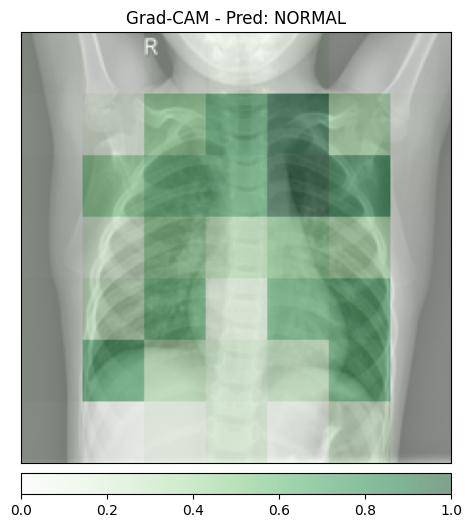
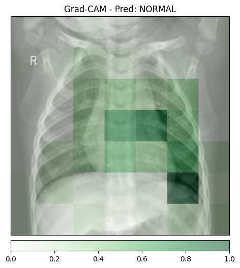
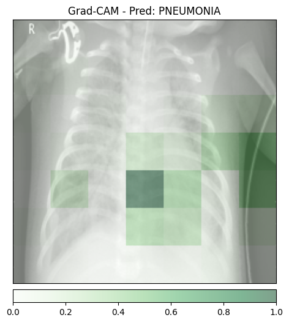
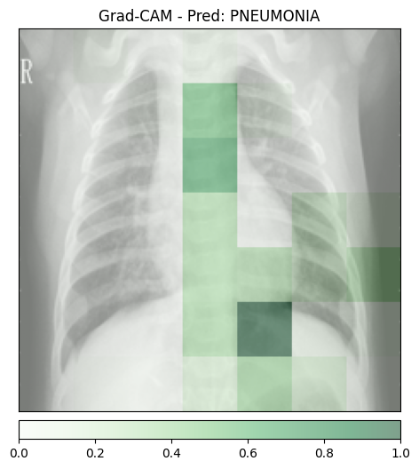

# TP 6: 
**OUALGHAZI Mohamed**
# Exercice 1:

## Grad-CAM normal_1

## Grad-CAM normal_2

## Grad-CAM pneumo_1

## Grad-CAM pneumo_2

**Analyse des faux positifs**

Dans les expériences réalisées, le modèle prédit correctement les classes pour les images testées :

* les images normales sont classées NORMAL
* les images avec pneumonie sont classées PNEUMONIA

L'énoncé suggère que le modèle pourrait produire un faux positif. Dans ce cas, l'analyse Grad-CAM permettrait de comprendre où le modèle regarde pour prendre sa décision.

L’objectif est de vérifier si l’attention du modèle se concentre réellement sur les zones pulmonaires présentant des anomalies, ou si elle se base sur des artefacts de l’image (bordures, zones sombres, annotations, contraste local, etc.).

Si la heatmap se concentrait sur des éléments non médicaux, cela indiquerait un comportement de type effet Clever Hans.
Ce phénomène correspond à un modèle qui apprend des corrélations trompeuses dans les données plutôt que de détecter de véritables caractéristiques médicales.

Dans nos visualisations Grad-CAM, les zones activées se situent principalement dans la région thoracique, ce qui suggère que le modèle utilise bien des indices présents dans les poumons pour effectuer sa prédiction.

 **Granularité de l’explication**

Les cartes Grad-CAM obtenues présentent une résolution relativement faible : les zones colorées apparaissent sous forme de blocs flous et étendus plutôt que des régions très précises au niveau du pixel.

Cette perte de précision provient de l’architecture du réseau ResNet utilisé par le modèle.

Au cours du passage dans le réseau de neurones convolutionnel :

l’image est progressivement transformée par plusieurs couches de convolution,
des opérations de downsampling (réduction de dimension) sont appliquées,
la résolution spatiale des cartes de caractéristiques diminue progressivement.

Grad-CAM utilise la dernière couche convolutionnelle du réseau pour générer l’explication.
À ce stade du réseau, la représentation spatiale de l’image est déjà fortement réduite.

La carte d’activation obtenue possède donc une résolution beaucoup plus faible que l’image originale.
Pour l’afficher sur l’image d’origine, cette carte est réinterpolée (upsampling), ce qui explique l’apparition de zones larges et floues dans la visualisation.

Ainsi, Grad-CAM fournit une explication sémantique globale indiquant les régions importantes pour la prédiction, mais il ne permet pas une localisation précise au niveau du pixel.

# Exercice 2:

